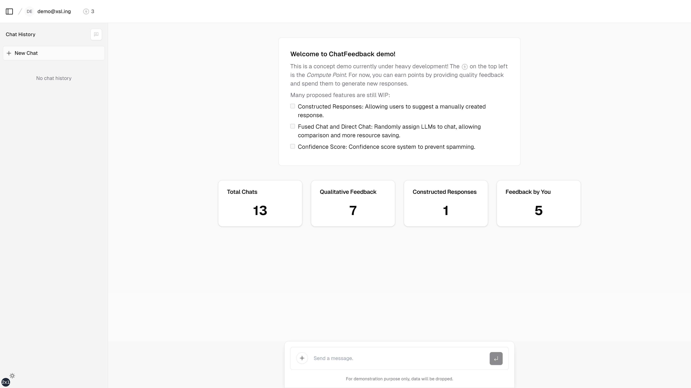

# ChatFeedback

`ChatFeedback` is an interactive system that incentivizes users to provide feedback on generated text, thereby collecting high-quality synthetic language data with human feedback. For more details, check the [project report](./.github/static/report.pdf).





## Run locally

Rename `.env.example` to `.env`, then fill in the fields:

- `OPENAI_API_KEY`: ChatFeedback currently adopts OpenAI models, so you'll need an API key to access the service.
- `AUTH_SECRET`: This is the key used to encrypt user session. You can get one by running:

```bash
openssl rand -base64 32
```

- `KV_*` and `POSTGRES_*`: ChatFeedback currently uses the storage solution provided by Vercel. Refer to their [doc](https://vercel.com/docs/storage) for more information about setting up your Vercel storage.

With a proper configuration, you should be able to run the application with:

```bash
pnpm install
pnpm run dev
```
